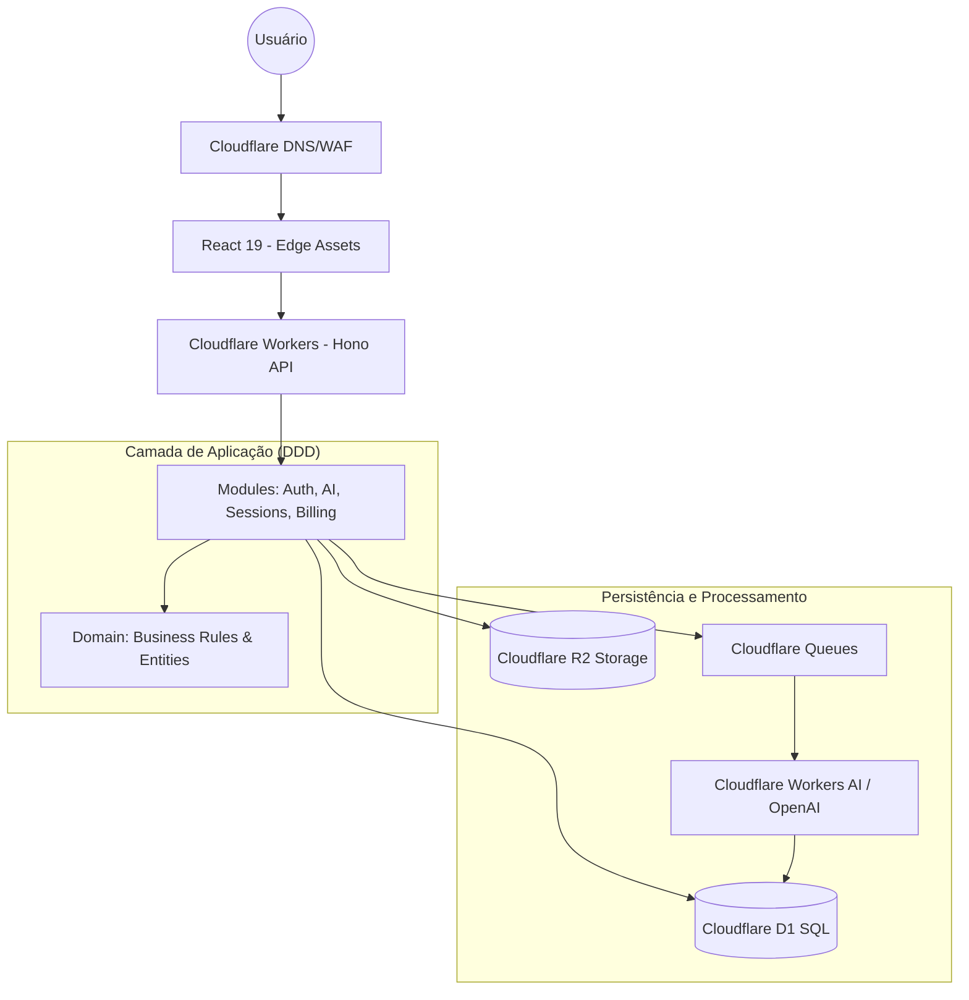

# Arquitetura do Projeto Constellar

## 1. Visão Geral Atual
O projeto é uma plataforma de Constelação Familiar Digital construída sobre o ecossistema da Cloudflare.

### Tecnologias Core:
- **Frontend:** React 19, React Router v7, Tailwind CSS, Radix UI.
- **Backend:** Hono (Framework Web) rodando no Cloudflare Workers.
- **Banco de Dados:** Cloudflare D1 (SQLite na borda).
- **Armazenamento:** Cloudflare R2 (Buckets).
- **Build System:** Vite com integração Cloudflare.

## 2. Estrutura de Pastas (Index Atual)
- `src/react-app/`: Código-fonte da aplicação React.
  - `pages/`: Fluxos de Home, Onboarding, Diagnóstico, Sessão e Resultados.
  - `components/ui/`: Biblioteca de componentes baseada em Radix UI.
- `src/worker/`: Ponto de entrada do backend Hono.
- `src/shared/`: Tipos TypeScript compartilhados entre frontend e backend.
- `wrangler.json`: Configuração de recursos Cloudflare (D1, R2, Queues, Services).

---

# Proposta de Evolução Arquitetural (SaaS & AI)

Como Principal Software Architect, proponho a seguinte evolução para transformar o Constellar em uma plataforma SaaS global e preparada para IA.

## 1. Diagrama de Arquitetura (Target)



## 2. Nova Estrutura de Pastas Recomendada (DDD)
Migração para uma estrutura orientada a domínio para suportar escalabilidade e múltiplos contextos:

```
src/
├── app/          # Bootstrap, Rotas e Entry Points (API & Frontend)
├── config/       # Variáveis de ambiente e constantes globais
├── modules/      # Features isoladas (Bounded Contexts)
│   ├── auth/        # JWT, RBAC, Auth Providers
│   ├── users/       # Gestão de perfis e preferências
│   ├── organizations/# Multi-tenancy, Memberships, Permissions
│   ├── sessions/    # Lógica de Constelação e Diagnóstico
│   ├── ai/          # Pipelines de análise e insights
│   └── billing/     # Integração com Stripe/Pagamentos
├── domain/       # Entidades e Regras de Negócio Puras (Framework-agnostic)
├── services/     # Adaptadores para serviços externos (Email, AI, SDKs)
├── infra/        # Implementações técnicas (Drizzle ORM, Repositories, Storage)
└── shared/       # Tipos, Zod Schemas e Utilitários transversais
```

## 3. Estratégias de Evolução

### 3.1. Escalabilidade Global
- **Edge First:** Toda a lógica de roteamento e processamento inicial permanece em Workers para latência mínima.
- **Async Workloads:** Uso de Cloudflare Queues para tarefas pesadas (geração de PDFs, análise profunda de IA, analytics) para liberar o Worker principal.

### 3.2. Multi-tenant SaaS
- **Isolamento:** Uso de `organization_id` em todas as tabelas críticas no D1.
- **RBAC:** Implementação de Roles (Admin, Member, Viewer) no nível do módulo de Organizations.
- **Middleware:** Injeção do contexto do tenant no Hono para garantir que as queries sejam filtradas automaticamente.

### 3.3. APIs Públicas
- **Versionamento:** Início imediato com `/api/v1/`.
- **Documentação:** Swagger/OpenAPI gerado via Zod-to-OpenAPI para facilitar a integração por parceiros.
- **Segurança:** Rate limiting via Cloudflare Workers e autenticação via API Keys.

### 3.4. Integração de IA
- **Análise Sistêmica:** Mapeamento dos inputs do diagnóstico para prompts estruturados.
- **RAG (Retrieval Augmented Generation):** Uso de Cloudflare Vectorize para alimentar a IA com bases de conhecimento sobre constelação sistêmica.
- **Feedback Loop:** Monitoramento de resultados para refinar os insights gerados pela IA.

## 4. Roadmap Técnico
1. **Mês 1:** Reestruturação de pastas e setup do Drizzle ORM com Migrations.
2. **Mês 2:** Implementação do núcleo Multi-tenant e autenticação centralizada.
3. **Mês 3:** Integração da camada de IA e processamento assíncrono via Queues.
4. **Mês 4:** Refatoração do Frontend para Feature-based Architecture e TanStack Query.
5. **Mês 5:** Lançamento da API Pública e dashboards de Analytics.
