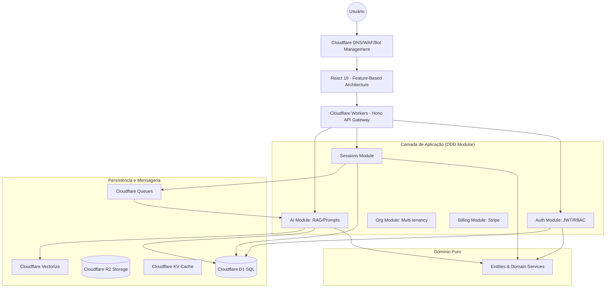

# Arquitetura do Projeto Constellar

## 1. Visão Geral Atual
O projeto é uma plataforma de Constelação Familiar Digital construída sobre o ecossistema da Cloudflare.

### Tecnologias Core:
- **Frontend:** React 19, React Router v7, Tailwind CSS, Radix UI.
- **Backend:** Hono (Framework Web) rodando no Cloudflare Workers.
- **Banco de Dados:** Cloudflare D1 (SQLite na borda).
- **Armazenamento:** Cloudflare R2 (Buckets).
- **Build System:** Vite com integração Cloudflare.

## 2. Estrutura de Pastas (Index Atual)
- `src/react-app/`: Código-fonte da aplicação React.
  - `pages/`: Fluxos de Home, Onboarding, Diagnóstico, Sessão e Resultados.
  - `components/ui/`: Biblioteca de componentes baseada em Radix UI.
- `src/worker/`: Ponto de entrada do backend Hono.
- `src/shared/`: Tipos TypeScript compartilhados entre frontend e backend.
- `wrangler.json`: Configuração de recursos Cloudflare (D1, R2, Queues, Services).

---

# Proposta de Evolução Arquitetural: Constellar Global SaaS & IA

Esta proposta visa elevar o projeto ao padrão de startup global, focando em escalabilidade, multi-tenancy e integração profunda de IA.

## 1. Diagrama de Arquitetura (Target)



## 2. Nova Estrutura de Pastas Recomendada (DDD)

```
src/
├── app/          # Bootstrap, Rotas Globais e Injeção de Dependência
├── config/       # Variáveis de ambiente, constantes e schemas de config
├── modules/      # Bounded Contexts (Features isoladas)
│   ├── auth/        # JWT, RBAC, Auth Middleware
│   ├── users/       # Perfis e preferências
│   ├── organizations/# Multi-tenancy, Memberships, Permissions
│   ├── sessions/    # Fluxo principal de Constelação
│   ├── diagnostics/ # Lógica de diagnósticos sistêmicos
│   ├── ai/          # RAG, Prompt Engineering, LLM Connectors
│   ├── billing/     # Planos e assinaturas
│   ├── analytics/   # Event tracking e métricas de negócio
│   └── notifications/# Email (Service Bindings), Push, SMS
├── domain/       # Entidades, Value Objects e Domain Services (Puros)
├── infra/        # Implementações Técnicas
│   ├── database/    # Drizzle ORM, Migrations, Repositories
│   ├── queues/      # Worker Processors para Background Jobs
│   └── storage/     # Abstrações do R2
├── services/     # Clientes de APIs Externas (Stripe, OpenAI, etc.)
└── shared/       # Zod Schemas e Tipos TS transversais
```

## 3. Modelo de Banco de Dados SaaS (Multi-tenant)
Utilizando o Drizzle ORM sobre o D1:
- **Tenant Isolation:** Inclusão de `organization_id` em todas as tabelas de domínio.
- **Relacionamentos:** `users` <-> `organization_members` <-> `organizations`.
- **RBAC:** Tabela `roles` e `permissions` vinculadas aos membros da organização.

## 4. Estratégias de Evolução

### 4.1. IA & Inteligência Sistêmica (RAG Architecture)
- **Pipeline:** Entrada do Usuário -> Busca Semântica (Vectorize) -> Recuperação de Contexto Sistêmico -> Prompt Engine -> LLM (Workers AI/GPT-4) -> Insights Sistêmicos.
- **Async:** Processamento pesado de análise via **Cloudflare Queues**.

### 4.2. Escalabilidade & Globalização
- **Edge Deployment:** Aproveitamento total da rede Cloudflare para latência zero.
- **API First:** Backend estruturado como API Pública versionada (`/api/v1/`).
- **Observabilidade:** Implementação de OpenTelemetry e Cloudflare Analytics Engine.

## 5. Roadmap Técnico de 12 Meses

| Fase | Período | Foco Principal |
| :--- | :--- | :--- |
| **I: Fundação** | Meses 1-2 | Migração para estrutura DDD e Drizzle ORM; Setup de Multi-tenancy básico. |
| **II: Core SaaS** | Meses 3-4 | Implementação de Auth/RBAC; Integração de Billing (Stripe); Dashboard de Gestão. |
| **III: AI Expansion**| Meses 5-7 | Pipeline RAG para diagnósticos; Análise automatizada de sessões via Queues. |
| **IV: Ecosystem** | Meses 8-10 | Lançamento de API Pública; Marketplace de Terapeutas/Ferramentas; Webhooks. |
| **V: Optimization** | Meses 11-12 | Escala global refinada; Analytics preditivo; Mobile App (React Native/Expo). |
